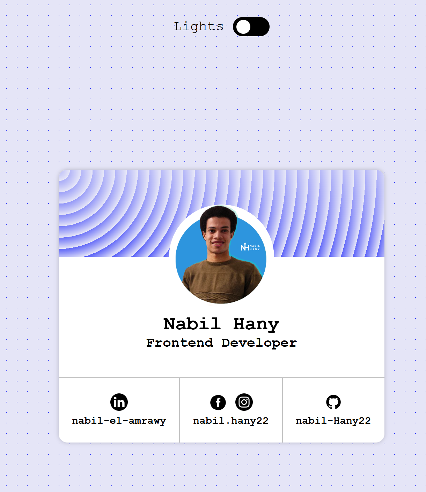
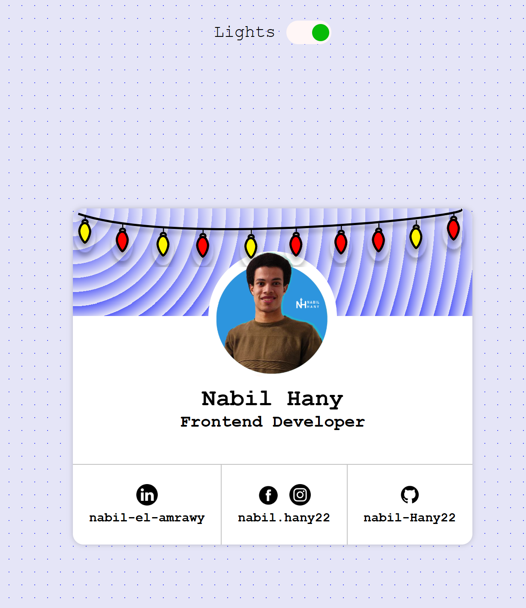
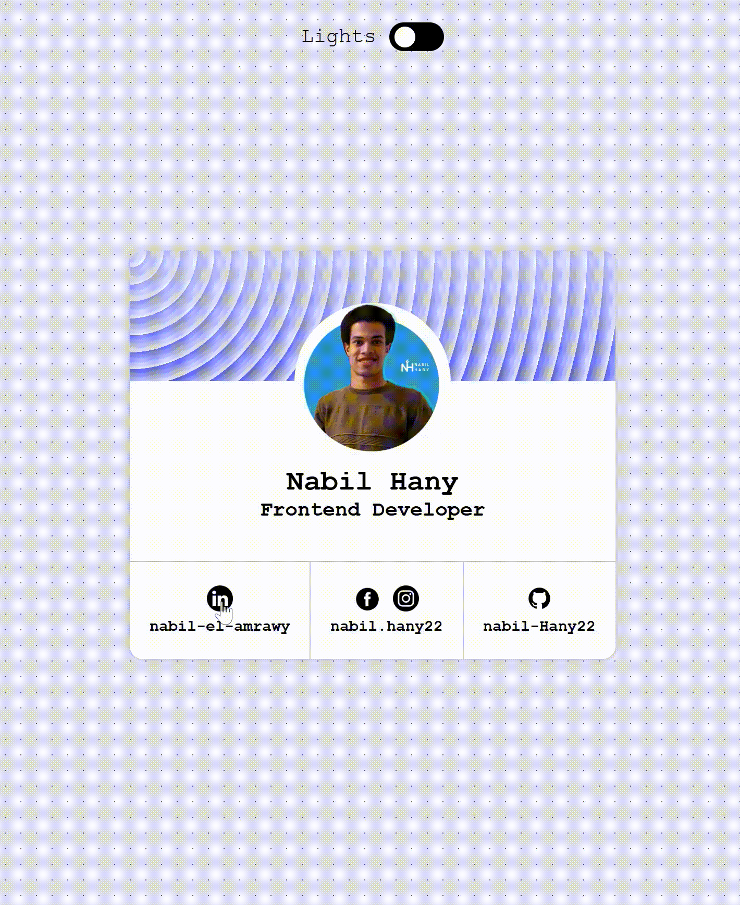

# 💡 Profile Card Component  

This is a **profile card component** project built using **HTML & CSS**.  
It includes a cool **light switch animation** that toggles the lamp on and off.  

---

## 🔗 Live Demo  
👉 [Click here to try it out!](https://nabil-hany22.github.io/Profile-card-component-/)

---

## 🚀 Project Preview  

### 🔦 Lamp States  
<p align="center">
  
  
</p>  

### 🎥 Animation Preview  
<p align="center">
  
</p>  

---

## 📂 Project Structure  

```
Profile-card-component-/
│
├── images/              # Contains icons & images used in the project
│
│
├── preview/             # Contains preview images & video
│   ├── 1_lamp_off.png
│   ├── 2_lamp_on.png
│   └── lamp_animation.mp4
│
│
├── index.html           # Main HTML file
├── style.css            # Styling file
└── README.md            # Project documentation
```

---

## 🛠️ Technologies Used  
- **HTML5**  
- **CSS3**  

---

## 📥 How to Use  

1. Clone this repository  
   ```bash
   git clone https://github.com/Nabil-Hany22/Profile-card-component-.git
   ```
2. Open `index.html` in your browser.  

---

✨ Built by [Nabil Hany](https://www.linkedin.com/in/nabil-el-amrawy/)
